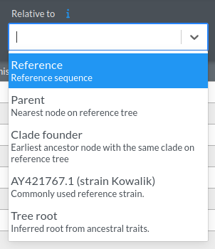

# Nextclade Setup for < your virus > with an inferred root as reference

This repository provides a streamlined setup for running Nextclade on < your virus > sequences using an inferred root sequence as the reference. It includes all necessary files and instructions to customize and run Nextclade analysis.

> ⚠️ **Warning:** This template sets the inferred root as the main reference. For the moment, we should set the inferred root as al alternative and the RefSeq as the main reference!

## Clone the repository

First, clone this repository to get all the necessary files to create your dataset:

```bash
git clone https://github.com/hodcroftlab/dataset-template-inferred-root.git
```

---
## Steps to Set Up The Workflow

These steps were developed specifically for this dataset, which has the following characteristics:
- The reference used is a static inferred root.
- The GFF annotation file may need to be adapted to this new reference. 

> 💡 **Note:** If you don't want to use the inferred root as reference, you can replace the files `./dataset/genome_annotation.gff3` and `./dataset/reference.fasta` with your desired reference.
> You can still use the `resources/auspice_config.json` to get a set of references for mutation calling in the dataset.

---
### 1. Follow the instructions from the `inferred-root` README.md
Follow the instructions found in the `inferred-root` README.md to obtain a static inferred root.

---
### 2. Get the files from the subfolders
Run:

```bash
cp ./inferred-root/data/* ./data
cp ./inferred-root/results/inferred-root-annotation.gff3 ./dataset/genome_annotation.gff3
cp ./inferred-root/results/inferred-root.fasta ./dataset/reference.fasta
```
---
### 3. Update `pathogen.json`
Modify `dataset/pathogen.json` to:
- Ensure file names match the generated reference files.
- Update attributes as needed.
- Adjust the Quality Control (QC) settings if necessary. If QC is not configured, Nextclade will not perform any checks.

For more details on configuration, refer to the [Nextclade documentation](https://docs.nextstrain.org/projects/nextclade/en/latest/user/input-files/05-pathogen-config.html). 

---
### 4. Update `auspice_config.json`
Modify `resources/auspice_config.json` to:
- Ensure the RefSeq node matches your virus's reference sequence
- Modify `title`, `build_url`, `maintainers`

This file is created to have the following options for mutation calling:



Where:
- Reference: Static inferred root
- < your RefSeq id >: Commonly used reference
- Tree root: Inferred root for the tree (can change every run)

---
### 5. Update the `Snakefile`
- Modify lines 1-18 to adjust paths and parameters.
- Ensure all necessary files for the Augur pipeline are present, including:
  - `sequences.fasta` & `metadata.tsv` 
    - can be downloaded from NCBI Virus via ingest: `FETCH_SEQUENCES==True`
  - [`auspice_config.json`](resources/auspice_config.json)
- These files are essential for building the reference tree and running Nextclade.

---

## Runnning the `Snakefile`
To create the auspice JSON and a Nextclade example dataset:
```bash
snakemake --cores 9 all
```
