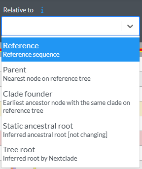

# Nextclade Workflow for &lt;your virus&gt;

This repository provides a reproducible workflow for building a custom [Nextclade](https://github.com/nextstrain/nextclade) dataset for *&lt;your virus&gt;*. It allows you to generate reference and annotation files, download and process sequence data, infer an ancestral sequence, and prepare all necessary files for Nextclade analysis and visualization.

---

## Folder Structure

You can follow the [Nextclade example workflow](https://github.com/nextstrain/nextclade_data/tree/master/docs/example-workflow) or use the following structure:

```bash
mkdir -p dataset data ingest resources results scripts
```

---

## Workflow Overview

This workflow consists of modular steps:

1. **Reference Generation**  
   Extracts reference and annotation files from GenBank.
2. **Dataset Ingest**  
   Downloads and processes sequences and metadata from NCBI Virus.
3. **Inferred Ancestral Sequence (optional)**  
   Infers a dataset-specific ancestral sequence to improve mutation and clade assignments in Nextclade.
4. **Augur Phylogenetics & Nextclade Preparation**  
   Builds trees, aligns sequences, and generates all required files for Nextclade and Auspice.
5. **Visualization & Analysis**  
   Enables both command-line and web-based Nextclade analyses, including local dataset hosting.

---

## Setup Instructions

### 1. Generate Reference Files

Run the script to extract the reference FASTA and genome annotation from GenBank:

```bash
python3 scripts/generate_from_genbank.py --reference "<your reference>" --output-dir dataset/
```

During execution, follow the prompts to select CDS annotations:
   - `[0]`
   - `[product]` or `[leave empty for manual choice]` to select proteins.
   - `[2]`.

**Outputs:**
- `dataset/reference.fasta`
- `dataset/reference.gbk`
- `dataset/genome_annotation.gff3`

---

### 2. Configure `pathogen.json`

Edit `pathogen.json` to:
- Point to your generated files (`reference.fasta`, `genome_annotation.gff3`)
- Adjust metadata and QC settings as needed

> [!WARNING]  
> If QC settings are not defined, Nextclade will skip quality control checks.

See the [Nextclade pathogen config documentation](https://docs.nextstrain.org/projects/nextclade/en/latest/user/input-files/05-pathogen-config.html) for details.

---

### 3. Prepare GenBank Reference

Move your GenBank file to `resources/reference.gbk`.  
Edit protein names and feature annotations if necessary for your dataset. Make sure they match the `annotation.gff3` name definitions.

---

### 4. Update the `Snakefile`

Adjust workflow parameters and file paths as needed.
Ensure the following files are available:
  - `data/sequences.fasta`
  - `data/metadata.tsv`
  - `resources/auspice_config.json`

Sequences and metadata can also be downloaded automatically using the ingest module (see below).

---

## Subprocesses

### Ingest

Automates the download of Enterovirus sequences and metadata from NCBI Virus.
See [ingest/README.md](ingest/README.md) for details.

**Required packages:**  
`csvtk, nextclade, tsv-utils, seqkit, zip, unzip, entrez-direct, ncbi-datasets-cli` (available via conda-forge or bioconda)

---

### Inferred Ancestral Sequence (Optional but Recommended)

The `inferred-root/` directory provides a reproducible pipeline for inferring an ancestral sequence for your dataset.
This sequence can be used as an alternative reference in Nextclade to improve mutation and clade call accuracy.

- **See:** [`inferred-root/README.md`](inferred-root/README.md) for details.
- To enable, set `STATIC_ANCESTRAL_INFERRENCE = True` in your config and run with:
  `--config static_inference_confirmed=true`.
- Without confirmation, the workflow will pause and prompt for user input.

> [!NOTE]  
> To skip this step, set `STATIC_ANCESTRAL_INFERRENCE = False`.

---

### 5. Configure `auspice_config.json`

Edit `resources/auspice_config.json` to:
- Match the **RefSeq node** to your chosen reference
- Update the **title, build_url**, and **maintainers**

Three reference options are available for mutation calling:

- **Reference** → RefSeq or another standard reference sequence
- **Static Inferred Ancestor** → Inferred Ancestral Sequence from the dedicated workflow
- **Tree root** → Tree-based root (changes with every re-run)  

*Example reference selector interface:*



---

## Running the Workflow

To generate the Auspice JSON and example Nextclade dataset, run:

```bash
snakemake --cores 9 all --config static_inference_confirmed=true
```

This will:
- Build the reference tree
- Produce the Nextclade dataset in `dataset/`
- Run Nextclade on example sequences in `out-dataset/sequences.fasta`
- Output results to `test_out/` (alignment, translations, summary TSVs)

### Labeling Mutations of Interest
To label mutations of interest, run the `mutLabels` rule separately.
The labels will be added to `out-dataset/pathogen.json`.

---

## Visualizing Your Custom Nextclade Dataset

To test your dataset in Nextclade Web, serve it locally:

```bash
serve --cors out-dataset -l 3000
```

Then open:

```
https://master.clades.nextstrain.org/?dataset-url=http://localhost:3000
```

- Click **Load example**, then **Run**
- Under "Settings → Sequence view", consider reducing *Max. nucleotide markers* to 500 for faster rendering

---

## Author & Contact

- Maintainers: Nadia Neuner-Jehle, Alejandra González-Sánchez, Emma B. Hodcroft ([hodcroftlab](https://github.com/hodcroftlab))
- For questions or suggestions, please [open an issue](https://github.com/enterovirus-phylo/dataset-template-inferred-root/issues/new) or email: eve-group[at]swisstph.ch

---

## Troubleshooting and Further Help

- See the [official Nextclade documentation](https://docs.nextstrain.org/projects/nextclade/en/stable/index.html#) for guidance.
- For details on the inferred ancestral sequence workflow, see [`inferred-root/README.md`](inferred-root/README.md).

---

This template provides a scalable, transparent workflow for building and maintaining high-quality Nextclade datasets for Enteroviruses — adaptable to other Enterovirus species as well.
